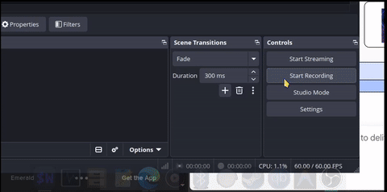

# Dock

[](https://github.com/resdon/dock/actions/workflows/rust.yml)

A lightweight, high-performance Wayland dock written in Rust



## Features

- **Wayland Native**: Built with Layer Shell and Foreign Toplevel protocols for smooth integration.
- **Fast & Lightweight**: Low resource consumption with seamless animations and hover effects.
- **Desktop & Steam Integration**: Resolves application icons, `.desktop` files, and Steam game launcher shortcuts dynamically.
- **Built-in Utilities**: Window management, context menus, drag-and-drop support, and status indicators.

## Supported Compositors (Wayland)

`dock` works on any Wayland compositor supporting `wlr-layer-shell-unstable-v1` and `wlr-foreign-toplevel-management-unstable-v1`:

- **labwc** (Primary target / recommended)
- **Sway**
- **Hyprland**
- **Wayfire**
- **river**
- **COSMIC**

## Prerequisites & Dependencies

### Rust Version
- **Cargo / Rustc**: `1.75.0` or higher (Rust Edition 2021 recommended)

### System Dependencies

Ensure the following build tools and development libraries are installed on your system:

- **Build Tools**: `make`, `gcc`, `pkg-config`
- **Wayland Libraries**: `wayland-client`, `wayland-protocols`
- **Input & Graphics**: `libxkbcommon`, `pixman`, `cairo`, `glib2`, `mesa` (EGL/GLES)
- **System Services**: `dbus`

#### Installing Dependencies on Arch Linux:
```bash
sudo pacman -S --needed base-devel cargo wayland wayland-protocols libxkbcommon fontconfig dbus cairo glib2 mesa
```

#### Installing Dependencies on Ubuntu / Debian:
```bash
sudo apt update
sudo apt install -y build-essential cargo pkg-config libwayland-dev wayland-protocols libxkbcommon-dev libfontconfig1-dev libdbus-1-dev libglib2.0-dev libcairo2-dev libegl1-mesa-dev libgles2-mesa-dev
```

## Installation

### Pre-compiled Binary
Download and extract the [latest release archive](https://github.com/resdon/dock/releases/latest/download/dock-linux-amd64.tar.gz):
```bash
tar -xzf dock-linux-amd64.tar.gz
cd dock-linux-amd64
make install
```
Or download via terminal:
```bash
curl -sSL https://github.com/resdon/dock/releases/latest/download/dock-linux-amd64.tar.gz | tar -xz
cd dock-linux-amd64
make install
```

### Building From Source

### 1. Clone the Repository
```bash
git clone https://github.com/resdon/dock.git
cd dock
```

### 2. Build and Install
Compile the binary in release mode and install it to system PATH (`/usr/local/bin`):

```bash
make install
```

*Alternatively, build manually via Cargo:*
```bash
cargo build --release
```

### 3. Launching the Dock

#### Run in Background (CLI):
```bash
nohup dock &
```

#### Autostarting on `labwc`:
Add the following line to `~/.config/labwc/autostart`:
```bash
dock &
```

#### Autostarting on `Sway` / `Hyprland`:
- **Sway** (`~/.config/sway/config`):
  ```sway
  exec dock
  ```
- **Hyprland** (`~/.config/hypr/hyprland.conf`):
  ```ini
  exec-once = dock
  ```

## Repository Structure

```text
dock/
├── assets/          # Bundled fonts and connection indicator icons
├── scripts/         # Launcher and icon listing scripts
├── src/             # Core Rust source files
│   ├── app/         # Main event loop and draw calls
│   ├── cache/       # Icon indexing and state persistence
│   ├── geometry/    # Dock layout math and bounding boxes
│   ├── graphics/    # Animation, fade, and visual effects
│   ├── handlers/    # Window list and context menu event handlers
│   ├── interaction/ # Proximity, motion, and hover routines
│   ├── pointer/     # Click, drag, and scroll input handling
│   ├── render/      # Framebuffer drawing and font rendering
│   ├── resolvers/   # Desktop file parser and Steam app resolver
│   └── services/    # Display & monitor detection services
├── Cargo.toml       # Cargo package manifest
├── Makefile         # Build & installation targets
└── PKGBUILD         # Arch Linux packaging file
```

## License

Distributed under the MIT License.
